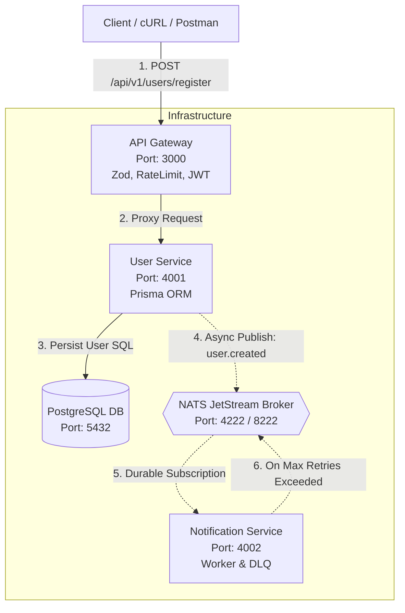
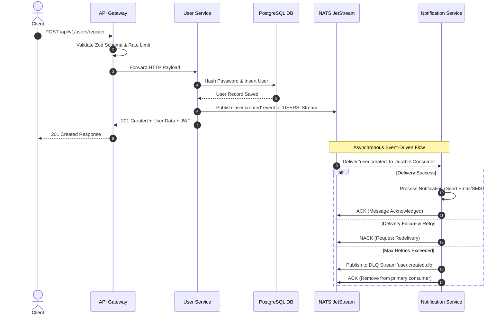

# Cloud-Native Distributed Microservices System

A production-ready, event-driven microservices architecture built with **Node.js**, **TypeScript**, **Express**, **PostgreSQL**, **Prisma ORM**, and **NATS JetStream**.

---

## Architecture Diagram



---

## End-to-End Event Flow



---

## File & Folder Structure

```
.
├── docker-compose.yml              # Unified stack orchestration
├── README.md                       # Architecture & Documentation
├── api-gateway/                    # API Gateway Service
│   ├── Dockerfile
│   ├── .env.example
│   ├── package.json
│   ├── tsconfig.json
│   └── src/
│       ├── app.ts                  # Gateway Entrypoint
│       ├── config/                 # Environment Configuration
│       ├── middlewares/            # Auth, RateLimiter, Validator, ErrorHandler
│       ├── routes/                 # Health & User Proxy Routes
│       └── validators/             # Zod Schemas
├── user-service/                   # User Domain Service
│   ├── Dockerfile
│   ├── .env.example
│   ├── package.json
│   ├── tsconfig.json
│   ├── prisma/
│   │   └── schema.prisma           # Prisma Data Schema
│   └── src/
│       ├── app.ts                  # Service Entrypoint
│       ├── config/
│       ├── controllers/            # Request/Response Handling
│       ├── events/                 # NATS JetStream Publisher
│       ├── middlewares/
│       ├── repositories/           # Prisma Data Access Layer
│       ├── routes/
│       ├── services/               # Business Logic & Password Hashing
│       └── validators/
└── notification-service/           # Notification Consumer Service
    ├── Dockerfile
    ├── .env.example
    ├── package.json
    ├── tsconfig.json
    └── src/
        ├── app.ts                  # Worker Entrypoint
        ├── config/
        ├── events/                 # NATS Client, Durable Consumer & DLQ Pattern
        ├── routes/                 # Health Endpoint
        └── services/               # Notification Processing Logic
```

---

## Prerequisites

- [Docker](https://docs.docker.com/get-docker/) (v20+ recommended)
- [Docker Compose](https://docs.docker.com/compose/install/) (v2+ recommended)
- [Node.js](https://nodejs.org/) v20+ (optional, for local development outside Docker)

---

## Quickstart Guide

Spin up the entire stack (PostgreSQL, NATS JetStream, User Service, Notification Service, and API Gateway) with a single command:

```bash
docker-compose up --build
```

To stop all services and clear volumes:

```bash
docker-compose down -v
```

---

## System Endpoints & Health Status

| Service | Port | Endpoint | Description |
|---|---|---|---|
| **API Gateway Swagger Docs** | `3000` | `http://localhost:3000/docs` | Interactive OpenAPI 3.0 UI |
| **API Gateway JSON Spec** | `3000` | `http://localhost:3000/docs/swagger.json` | Raw OpenAPI 3.0 JSON specification |
| **API Gateway Health** | `3000` | `http://localhost:3000/health` | Gateway status & uptime |
| **User Service** | `4001` | `http://localhost:4001/health` | Service & DB status |
| **Notification Service** | `4002` | `http://localhost:4002/health` | Worker & NATS connection status |
| **NATS Monitoring** | `8222` | `http://localhost:8222/varz` | NATS Server HTTP Monitoring |

---

## API Documentation & Example cURL Commands

### 1. Register a New User

Creates a user in PostgreSQL and publishes a `user.created` event to NATS JetStream.

```bash
curl -X POST http://localhost:3000/api/v1/users/register \
  -H "Content-Type: application/json" \
  -d '{
    "email": "alice@example.com",
    "password": "Password123!",
    "name": "Alice Smith"
  }'
```

**Expected Response (`201 Created`):**
```json
{
  "success": true,
  "message": "User registered successfully",
  "data": {
    "id": "e3a89e9f-5471-460d-8df6-981f3b0c5112",
    "email": "alice@example.com",
    "name": "Alice Smith",
    "createdAt": "2026-08-13T18:00:00.000Z"
  },
  "token": "eyJhbGciOiJIUzI1NiIsInR5cCI6IkpXVCJ9..."
}
```

---

### 2. Login User

Authenticates user credentials and returns a JWT bearer token.

```bash
curl -X POST http://localhost:3000/api/v1/users/login \
  -H "Content-Type: application/json" \
  -d '{
    "email": "alice@example.com",
    "password": "Password123!"
  }'
```

---

### 3. Get User Profile (Protected Route)

Requires `Authorization: Bearer <token>` header verified by the API Gateway.

```bash
curl -X GET http://localhost:3000/api/v1/users/profile \
  -H "Authorization: Bearer YOUR_JWT_TOKEN_HERE"
```

**Expected Response (`200 OK`):**
```json
{
  "success": true,
  "data": {
    "id": "e3a89e9f-5471-460d-8df6-981f3b0c5112",
    "email": "alice@example.com",
    "name": "Alice Smith",
    "createdAt": "2026-08-13T18:00:00.000Z"
  }
}
```

---

## Verification & Resilience Testing

### 1. Inspecting Live NATS JetStream Events & Logs

Watch the Notification Service log stream to verify asynchronous event processing when registering a user:

```bash
docker-compose logs -f notification-service
```

When a user is created, you will observe logs similar to:

```text
microservices_notification_service  | [Notification Consumer] Received message [Seq: 1, Redelivery: 0/3] for User: alice@example.com
microservices_notification_service  | [Notification Service] 📧 Processing notification for user: Alice Smith (alice@example.com)
microservices_notification_service  | [Notification Service] ✅ Welcome email & SMS successfully delivered to alice@example.com
microservices_notification_service  | [Notification Consumer] Message [Seq: 1] ACKNOWLEDGED.
```

---

### 2. Testing Dead Letter Queue (DLQ) & Retry Pattern

Register a user with an email ending in `@dlq-test.com` to simulate notification delivery failure:

```bash
curl -X POST http://localhost:3000/api/v1/users/register \
  -H "Content-Type: application/json" \
  -d '{
    "email": "test-failure@dlq-test.com",
    "password": "Password123!",
    "name": "Fail Test User"
  }'
```

**Observed Resilient Behavior in `notification-service` logs:**

1. **Attempt 1**: Processing fails, message is `NACK`ed.
2. **Attempt 2 & 3**: Redelivered by NATS JetStream durable consumer.
3. **Max Retries Exceeded**: Message is routed to subject `user.created.dlq` on stream `USERS_DLQ` and ACKNOWLEDGED on the primary stream.

```text
microservices_notification_service  | [Notification Consumer] Received message [Seq: 2, Redelivery: 0/3] for User: test-failure@dlq-test.com
microservices_notification_service  | [Notification Consumer] Processing failed for User: test-failure@dlq-test.com (Attempt 1): Simulated notification delivery failure for test-failure@dlq-test.com
microservices_notification_service  | [Notification Consumer] NACKING message [Seq: 2] for retry...
...
microservices_notification_service  | [Notification Consumer] Max retries (3) reached for message [Seq: 2]. Routing to DLQ...
microservices_notification_service  | [Notification Service DLQ] Message routed to DLQ subject "user.created.dlq", seq: 1. Reason: Simulated notification delivery failure for test-failure@dlq-test.com
```

---

## Production Security & Architectural Best Practices

- **Zero Direct Cross-Service REST Calls**: User Service communicates with Notification Service strictly via asynchronous NATS JetStream messages.
- **Graceful Shutdown Hooks**: Each microservice handles `SIGINT`/`SIGTERM` to safely drain NATS connections and database pools without dropping in-flight requests.
- **Decoupled Layers**: Built with strict separation of concerns (`controllers/`, `services/`, `repositories/`, `events/`, `config/`, `middlewares/`).
- **Secret Hygiene**: All environment variables use strictly configured `.env` files with sample fallback definitions.
